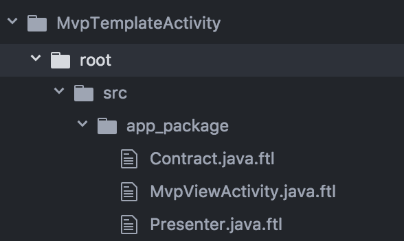
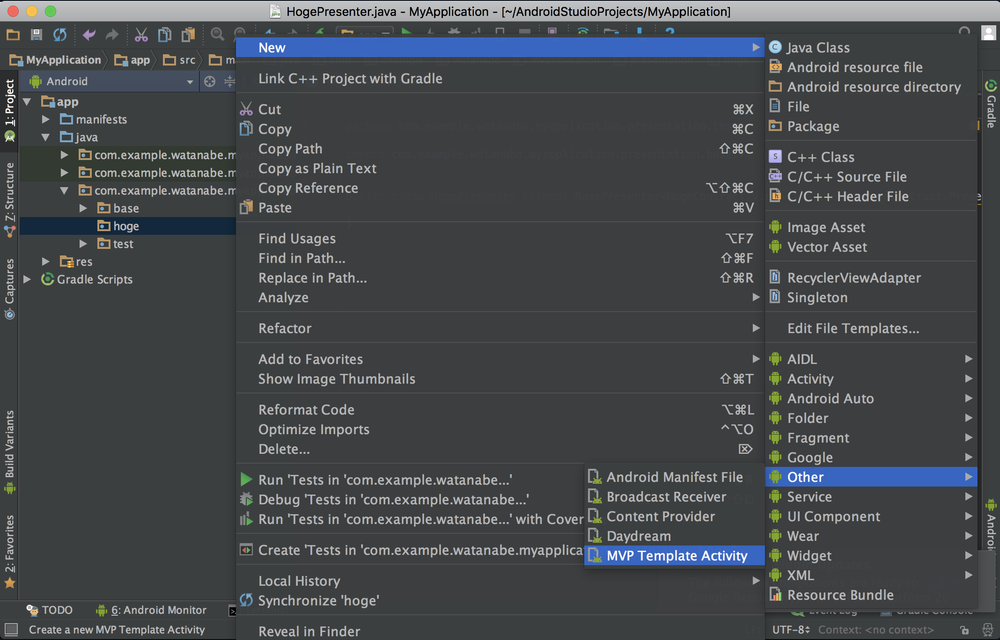
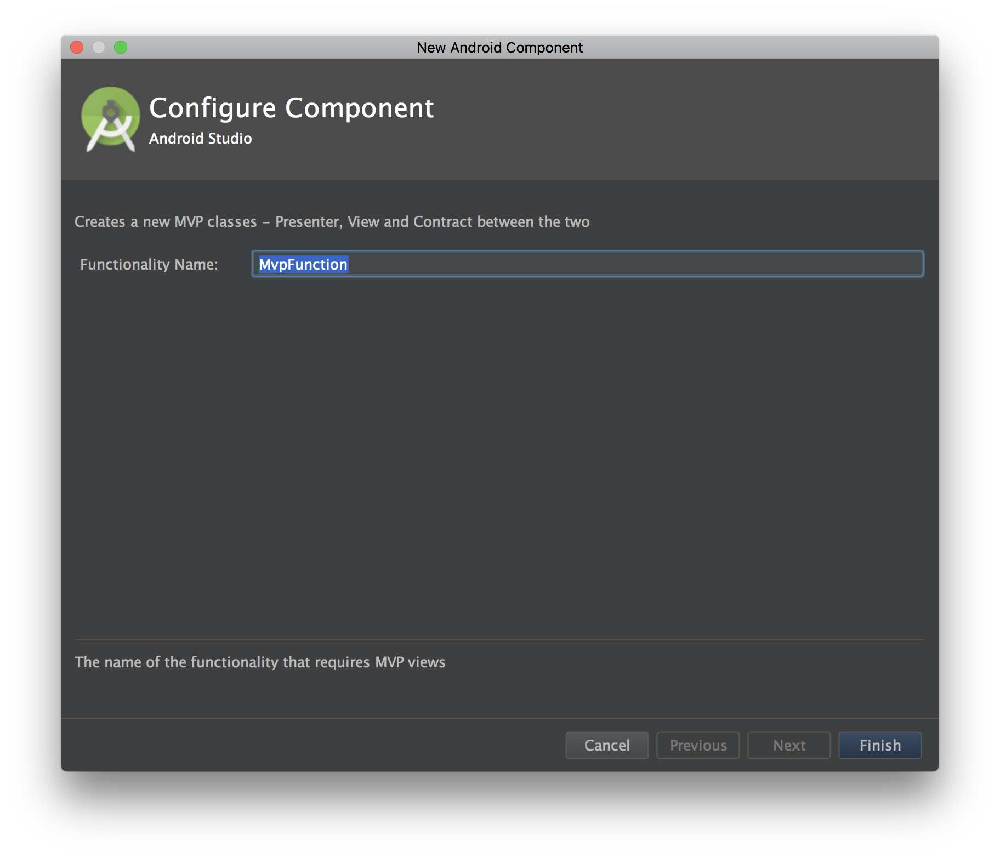

# How to create a group of File Templates in Android Studio
tag : `AndroidStudio`  
url : https://riggaroo.co.za/custom-file-template-group-android-studiointellij/

Android Studioテンプレートはテンプレート定義に[Freemarker](http://freemarker.org/)を使用します。 この記事では、Android Studioの既定のテンプレートと同様の結果を得ることができる一連のファイルテンプレートを作成します。

## How to create a group of file templates
この例では、MVP機能を作成するためのファイルテンプレートのカスタムグループを作成する方法を見ていきます。 我々は、2つの間のインターフェースを定義する`Presenter`、`Activity`、`Contract`を作成する必要があります。


- テンプレートフォルダの場所に移動します。

```
/Applications/Android Studio.app/Contents/plugins/android/lib/templates/other/
```
- AndroidStudioのインストール場所に、テンプレートの名前を付けてフォルダを作成します。たとえば、`MVP Template Activity`などです。

- 作成したばかりのフォルダに以下のファイルとフォルダを定義します。
  - `template.xml` - これはテンプレートに関する情報（Name、minSdkVersionなど）を含みます。
  - `recipe.xml.ftl` - これには、テンプレートを作成する方法を説明する指示が含まれています。どのような変数をユーザに尋ねるか、それらの変数で何をすべきかなどが含まれます。
  - `globals.xml.ftl` - グローバル変数を定義します
  - `root /`フォルダ - これはテンプレートコードを含みます。

- `template.xml`に、アプリに関する情報で置き換えられた次のxmlを置きます。

```
<template format="4"
        revision="1"
        name="MVP Template Activity"
        description="Creates a new MVP classes - Presenter, View and Contract between the two">

    <category value="Other"/>

    <parameter id="className"
        name="Functionality Name"
        type="string"
        constraints="class|unique|nonempty"
        default="MvpFunction"
        help="The name of the functionality that requires MVP views"/>

    <globals file="globals.xml.ftl" />
    <execute file="recipe.xml.ftl" />
</template>
```
このファイルには、ユーザーから要求されるすべてのパラメーターが含まれています。 この場合、ユーザーに、作成するMVP機能の名前を尋ねています。

- `recipe.xml.ftl`では、レシピの実行方法、ユーザーから要求されるパラメーター（パラメーターのタイプも）、およびそれらをインスタンス化する順序を定義します。

```
<?xml version="1.0"?>
<recipe>
    <instantiate from="src/app_package/Contract.java.ftl"
                   to="${escapeXmlAttribute(srcOut)}/${className}Contract.java" />
    <instantiate from="src/app_package/MvpViewActivity.java.ftl"
                   to="${escapeXmlAttribute(srcOut)}/${className}Activity.java" />
    <instantiate from="src/app_package/Presenter.java.ftl"
                   to="${escapeXmlAttribute(srcOut)}/${className}Presenter.java" />


    <open file="${srcOut}/${className}Presenter.java"/>
</recipe>
```
ここでは、作成されるさまざまなファイルと、出力ファイルの名前を置き換える場所を指定しています。 また、最後に開くファイルを指定します。


- `globals.xml.ftl`に以下を記述します：

```
<?xml version="1.0"?>
<globals>
 <global id="resOut" value="${resDir}" />
 <global id="srcOut" value="${srcDir}/${slashedPackageName(packageName)}" />
</globals>
```

- 次に、ルートフォルダで次のフォルダ構造を作成します。


- Contract.java.ftl

```
package ${packageName};

import com.mypackage.presentation.base.MvpPresenter;
import com.mypackage.presentation.base.MvpView;

public interface ${className}Contract{

    interface View extends MvpView {

    }

    interface Presenter extends MvpPresenter<View> {

    }
}
```
- MvpViewActivity.java.ftl

```
package ${packageName};

import com.mypackage.presentation.base.*;
public class ${className}Activity extends BaseActivity implements ${className}Contract.View {

    ${classname}Contract.Presenter presenter;

    @Override
    protected void onCreate(final Bundle savedInstanceState) {
        super.onCreate(savedInstanceState);

        presenter = new ${className}Presenter();
        presenter.attachView(this);
    }

    @Override
    protected void onDestroy() {
        super.onDestroy();
        presenter.detachView();
    }
}
```
- Presenter.java.ftl

```
package ${packageName};

import com.mypackage.presentation.base.*;

public class ${className}Presenter extends BasePresenter<${className}Contract.View> implements ${className}Contract.Presenter{

}
```

- これを使用するには、Android Studioを再起動する必要があります。 再起動したら、テンプレートを作成するパッケージを右クリックし、以下のように「新規」メニューからパッケージを選択します。


- 次に、template.xmlで求めた変数を入力するよう求められます


- 新しいMVP機能に必要なすべてのクラスが生成されます。 同じ種類のクラスを作成していて、`Presenter`と`Activity`を互いにリンクさせる方法を調べなければならないことが分かりました。 これをテンプレートとして実装することにより、チーム全体がそれを使用できるようになり、標準化と新しいスクリーンやクラスの作成が容易になります。

## Known Issue
Androidスタジオをアップグレードして、上で指定したインストールエリアにファイルテンプレートのカスタムグループがある場合、Studioは、削除する必要のある領域に競合があるとします。 残念ながら、それらを削除して、アップグレード後に同じフォルダに配置する必要があります。 ここでこの機能リクエストをチェックしてください。
