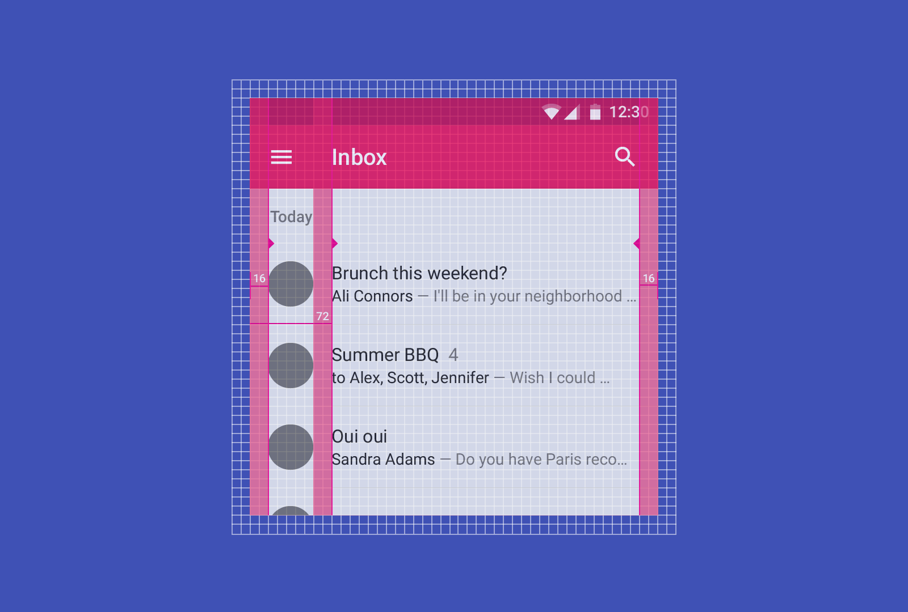

# Design from iOS to Android
tag : Design  
url : https://design.google/library/design-ios-android-and-back-again/

## A practical guide to designing across platforms

プラットフォーム間の設計と開発は、さまざまな国を旅行するようなものです。あなたはあなたがどこにいるかにかかわらず、同じ動き、つまり寝ること、食べること、観光することをします。しかし、あなたが訪れている国の習慣は、あなたがそれらをやり遂げる方法を指示します。いくつかの国では、人々を列車に押し入れるか、ナイフとフォークでハンバーガーを食べることは大丈夫です。同様に、あなたがiOSのために最初にあなたの製品を開発した場合、あなたのアプリが翻訳で失われてしまうので、それを問題なくAndroidに移植できると単純に期待するべきではありません。設計と開発を始める前に、各プラットフォームのイディオムと振る舞いを理解することが重要です。こうすることで、ユーザーはネイティブのプラットフォーム上でアプリを使用して簡単に理解できるようになり、どこで使用されているかにかかわらず、最も明確で真のバージョンの製品が得られます。このガイドでは、iOSからAndroidへの移行（そして元に戻す）のための実践的なヒントについて説明します。

## Get acquainted with Material Design

マテリアルデザインは、有形のサーフェス、太字のグラフィックデザイン、意味のあるモーションを使用したクロスプロダクト、クロスプラットフォーム設計に対する新しいアプローチであり、ソフトウェアの動作方法を定義するのに役立ちます。 また、Android 5.0以降のデバイスのデフォルトのビジュアル言語でもあるため、システムの原則を学ぶことで、どこで開発を始めてもプロジェクトに大きな利益をもたらします。

[マテリアルデザインガイドライン](https://material.io/guidelines/)では包括的なガイダンスが提供されていますが、iOSから来ているときには注意が必要です。

### Surfaces & depth

iOSでは従来、ぼかし効果を使って奥行きを表示していましたが、Androidで盛り上がったサーフェスやシャドウの使用に焦点を当てたいと思うでしょう。 これらの特性は、マテリアルデザインのオブジェクトに適用され、アプリケーション間で一貫して適用される空間モデルの作成に役立ちます。

### Interaction & motion

マテリアルデザインでは、ユーザーが開始したモーションやタッチレスポンスに重点を置いています。 要素をタッチすると、指から発するタッチリップルに加えて、ボタンが仰角（基本的にシャドウが盛り上がる）から指を「合わせる」ことができます。 この「磁気的な」反応は、iOSやウェブ上の色の変化や調光などの一般的なタッチフィードバックのスタイルから逸脱しています。 この磁気反応は確かにデジタルです。
さらに、2つの離散的な画像を使用するのではなく、タッチリップルと磁気反応の両方が、デフォルトと押された状態との間で滑らかに遷移する。 これは、材料設計における視覚的な連続性の概念を、ほとんど顕微鏡レベルで表した素晴らしい例です。

### Layout grid

Androidとマテリアルデザインの両方で普及しているグラフィックデザインのコンベンションは、グリッドシステムを厳格に遵守することです。 すべてが8dpグリッド（下のDPを参照）に揃えられ、アプリ全体で一貫した視覚リズムを作り出します。 たとえば、ボタンの高さは48dp、アプリバーのデフォルトは56dp、要素間の間隔は8dpの倍数になります。

# It's important to understand the idioms and behaviors of each platform before you start design and development.
(設計と開発を始める前に、各プラットフォームのイディオムと振る舞いを理解することが重要です。)



さらに、テキストやその他の要素は、マガジンや書籍のマージンを定義する垂直ルールに似ている、キーラインに左揃えまたは右揃えで配置されていることがよくあります。 電話機の標準的なキーラインは16dpと72dpですが、これらは特定のアプリのニーズや課題に合わせてカスタマイズできます。

### Typography

タイプはAndroidとマテリアルデザインで非常に重要な役割を果たします。 RobotoはAndroid用のデフォルトフォントファミリであり、いくつかの重みと凝縮された変形を含みます。 しかし、iOSと同じように、ブランドの印刷用パレットをアプリに組み込む必要があります。 AndroidのフォントレイアウトエンジンとラスタライザはOSXとiOSのものとは異なるので、いくつかのAndroidデバイスでフォントをテストしてください。 時には同じ書体が別の書式よりも1つのフォント書式で見栄えが良いこともあるので、書体のOTFとTTFをそれぞれ抜粋してください。 最後に、タイポグラフィでは4dpのわずかに細かいベースライングリッドが使用されるため、行の高さは20dp、24dp、32dp、36dpなどにする必要があります。

## So what’s different about Android?

`Use density-independent pixels (dp) and design in vector at 1x`  
(密度に依存しないピクセル（dp）を使用し、vectorで1xでデザインする)

Androidでは、重要な測定単位は密度に依存しないピクセルです（DIPまたはDPと省略されることもあります）。 iOSまたはウェブデザインの背景から来ている場合、DPは基本的にiOSまたはCSSピクセルのポイントと同等です。 DPの測定とサイジングは、さまざまな密度のデバイス間で一貫した物理的サイズを持つデザインを保証します。


AndroidでのDPの定義は簡単です：

```
1dp = 1px @ 1x（Androidでは1xは160dpi）
```

## Measuring and sizing things in DPs ensures your designs have a consistent physical size across devices of varying density.
(DPの測定とサイジングは、さまざまな密度のデバイス間で一貫した物理的サイズを持つデザインを保証します。)

スケッチやイラストレーターのようなベクトルソフトウェア（またはPhotoshopのシェイプを使用）を使用してレイアウトからDPのアイコンまでを設計することは、数学をもっと簡単にし、通常はラスターイメージから得られるビジュアル品質を犠牲にしません。 アイコンやその他の静的資産のようなものをエクスポートする時間が来たら、以下に列挙されているキー密度をエクスポートします。

|Density bucket|	Scaling factor|	Density|
|:---:|:---:|:---:|
|MDPI	|1x|	160dpi|
|HDPI	|1.5x|	240dpi|
|XHDPI	|2x|	320dpi|
|XXHDPI	|3x|	480dpi|
|XXXHDPI	|4x|	640dpi|

Androidはあなたのassetsをスケールダウンもしくはスケールアップするので、必ずしもバケットごとに提供する必要はありません。 また、開発者は自動的に縮小されたバージョンを生成するためのツールを多数用意しています。 さらに、`Android 5.0`にはベクターアイコンのサポートが組み込まれており、密度ごとのアイコンアセットをエクスポートする必要性を排除するツールが多数用意されています。 測定単位と密度の詳細については、[マテリアルデザインガイドライン](https://material.io/guidelines/layout/units-measurements.html#)とSebastien Gabrielの[DPIデザイナーズガイド](http://sebastien-gabriel.com/designers-guide-to-dpi/)の推奨事項を参照してください。


## Apps vs. activities

フードの下では、Androidアプリは単なる「アクティビティ」の集まりであり、通常、各アクティビティはアプリ内では1つの画面になっています。アクティビティは「インテント」を使用して接続されます。たとえば、アクティビティAのボタンを押すと、「起動アクティビティB」を表すインテントがトリガされます。直感的な音ですか？インテントを本当に強力にするのは、

- アプリ全体で機能する（ネイティブのデスクトップやiOSアプリのカスタムURLスキームの拡張バージョンなど）
- これらは一般的に定義することができ、以前のアクティビティに情報を返すこともできます（「写真撮影アプリを起動して写真を送ってください」など）

## Intents make it so you don’t need to reinvent the wheel.
(インテントにより、ホイールを再構築する必要はありません。)

たとえば、メッセージングアプリを構築しているとします。ユーザーがこれらの種類のアプリで画像を送信できるようにするのは一般的です。あなたの最初の傾向は、フォトギャラリーピッカーと、場合によってはフォトエディタと一緒に、カメラスクリーンをデザインすることかもしれません。幸運なことに、インテントを使用すると、ホイールを再開発する必要がなくなり、インストールしたカメラアプリ、写真ピッカー、写真編集アプリのいずれかを使用できるようになります。フローは次のようになります。

ユーザーはあなたのアプリで「写真を送る」を押します。それは、「撮影するか写真を選択するか」を表す意図を引き起こす。 Android上のほとんどのカメラアプリは、「写真を撮る」アクティビティでこのインテントをサポートしています。
ユーザーは自分のカメラアプリを選択します。写真を撮った後、カメラアプリは「写真を編集」オプションを表示することがあります。カメラアプリは、「この写真を編集する」という意図をトリガすることができます。
ユーザには、写真を編集できるアプリケーションのリストが提示され、ユーザはその写真を選択することができる。写真を編集した後、「OK」を押してアプリに戻ることができます。写真編集アプリは、編集した写真をカメラアプリに戻し、カメラアプリはその写真をあなたのアプリに戻します。
あなたのアプリは、編集した写真を取り込んでメッセージで送信します。
iOS 8で提供されるApp Extensionsの多くは、インテントを使用して実装されたAndroidの同等機能を備えています。たとえば、アプリが写真やテキストをアプリと共有できるようにするには、アプリで「メッセージを作成する」アクティビティが「このテキストを共有する」と「この写真を共有する」というインテントをサポートしていることを確認するだけです。

インテントでは、ウェブサイトをネイティブのアプリに置き換えることもできます。たとえば、アプリのアイテム詳細アクティビティで「view www.example.com/item/\*」を表すインテントをサポートできると指定した場合、ウェブブラウザのリンクをクリックすると、そのページを訪問するかあなたのネイティブアプリ内で開くかどうかを選択できます（そしておそらく好みを保存する）。

## The system status bar, navigation bar, and physical buttons

Androidでは、ユーザーは常にシステムのBack、Home、および多くの場合Overview（以前のRecents）機能にアクセスできます。 戻る、ホーム、および概要のシステムコントロールは、ハードウェアキーとして、またはAndroidの「ナビゲーションバー」と呼ばれる画面の下部にソフトウェアレンダリングされたボタンバーとして表示できます（iOSのナビゲーションバーと混同しないでください。 Androidのアプリバーと同様に、アプリのタイトルとアクションを格納しています）。


Androidデバイスには、ローカルタイム、電波強度、バッテリーレベルなどの通知や情報へのアクセスを提供する永続ステータスバーもあります。 Androidは、ソフトウェアナビゲーションバー（存在する場合）とステータスバーを考慮し、自動的にその領域を予約し、アプリで使用できる画面の部分を減らします。たとえば、Nexus 5では、画面が360x640dpの場合、ポートレートモードのナビゲーションバーの高さは48dpで、ステータスバーの高さは24dpで、コンテンツを表示するには360x568dpのスペースが必要です。ステータスバー（および制限された状況ではナビゲーションバー）を非表示にすることはできますが、システムUIを残しておき、ユーザーがそれらのシステム機能にすぐにアクセスできるようにすることが最善です。 Android 4.4および5.0には、システムのUIの背後に描画してアプリコンテンツをより没入感あふれる新しい機能が追加されました。最後に、ハードウェアのボリュームキーを使用することが保証されているため、ほとんどの場合、ソフトウェアUIにボリュームコントロールを含める必要はありません。
