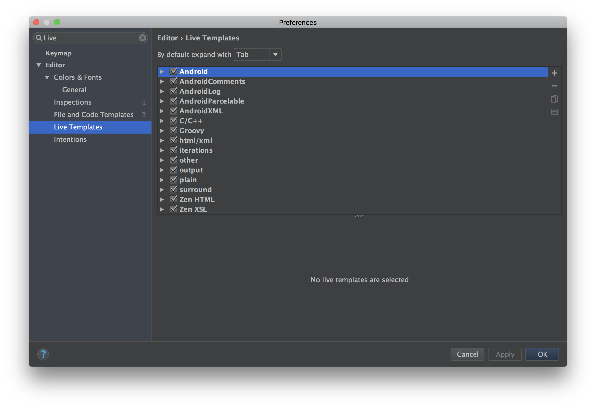
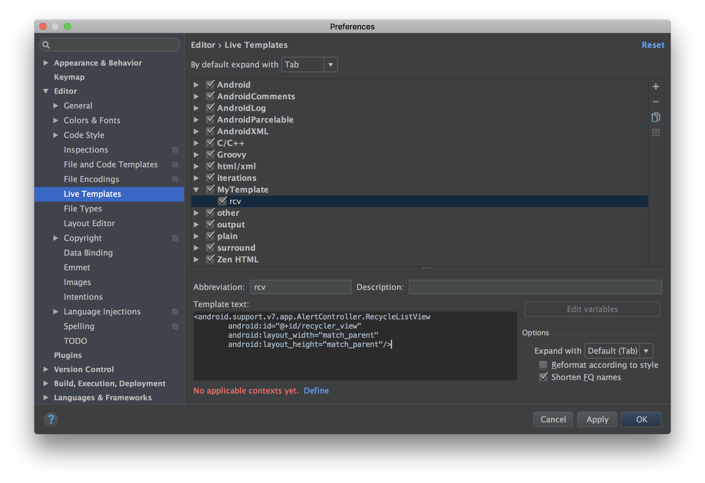
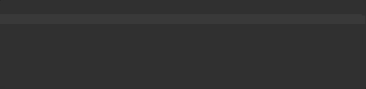

# LiveTemplate
tag : `AndroidStudio`  
url : https://riggaroo.co.za/create-live-templates-android-studio/

ライブテンプレートは、ソースコードファイルに素早く、効率的に、正確に挿入できる、頻繁に使用されるカスタムコード構造です。

たとえば、「psfi」と入力してAndroid StudioでEnterキーを押します。 `public static final int`という単語を自動的に生成します。 それによって19回のキーストロークが節約できます！ すでに使用されている定義済みライブテンプレートがいくつかあります。

- `logm` : 渡された引数とともに呼び出されているメソッド名を記録します。 （最も有用だと思う）
- `psfs` : public static final Stringに置き換えられます。
- `.null` : if（item == null）{}と入力するのではなく、コードをヌルチェックで囲みたいとき。 項目の後ろに.nullと入力し、Enterキーを押します。 これはオブジェクトをヌルチェックで囲みます！

便利でしょ？ あなた自身のライブテンプレートを作成する機能はさらに優れています。

## How to create your own Live template
1. Android Studio -> Preferences -> Live Templates
（ここでは利用可能なテンプレートの一覧も表示されますが、便利なテンプレートがいくつかあるので、確かめておきましょう）。

2. `+`ボタンをクリックし、「TemplateGroup」を作成します。 名前を付けてください。

3. `+`ボタンをもう一度クリックし、「LiveTemplate」を選択します。 これで、使用する省略形とテンプレートの簡単な説明を指定することができます。 テンプレートテキストを指定する必要があります。 これは省略形を入力するときに省略形に置き換えられるものです。

`Define`をクリックしてテンプレートのコンテキストを定義します。この場合、XMLをどのような種類のファイルとして使用するかを選択します。

## There we have it, custom live templates!
